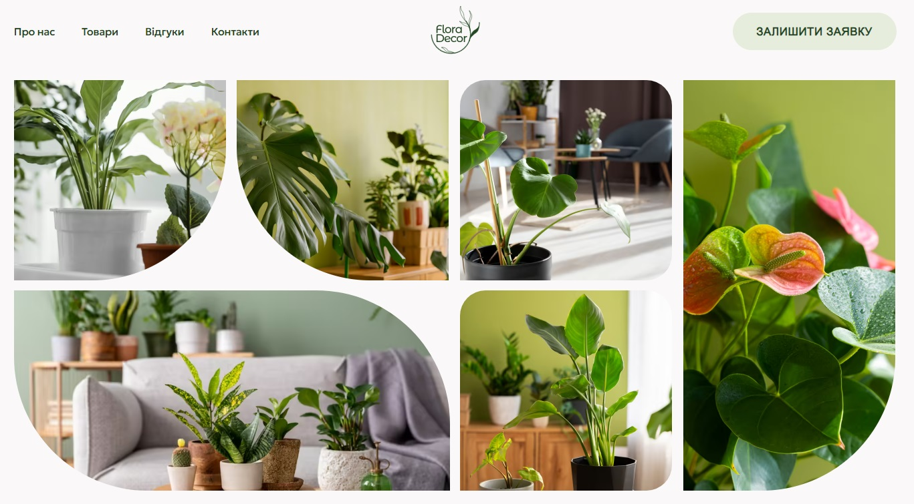

# Flora Decor Store Web App

## Overview

This repository contains the source code for a Next.js application named "Flora
Decor". The web application was created for a Ukrainian indoor plant store.

Explore [the site](https://flora-decor.vercel.app/) and the
[Figma layout](https://www.figma.com/file/UEeglZ9wIXEqpDxlELq0xF/Flora-Decor?type=design&node-id=1386-1431&mode=design).

## Technologies Used

- **Next.js:** is a reactive framework for developing web applications based on
  React. It provides capabilities for server-side rendering, static generation,
  and client-side rendering.
- **Typescript:** is a programming language that extends JavaScript by adding a
  statically typed system. This allows for detecting and fixing errors during
  development, improves auto-documentation, and facilitates code maintenance.
- **Tailwindcss:** is a utility-first CSS framework for creating custom user
  interfaces by composing small, reusable classes.
- **Sanity:** is a flexible content management platform that provides tools for
  creating and editing structured content through APIs.
- **React-hook-form:** is a library for managing forms in React, which allows
  easy state management of forms and their validation using hooks.
- **React-responsive:** is a React library that enables responsiveness to screen
  sizes and other media queries within components.
- **React-scroll:** is a library for smooth scrolling to different sections of a
  web page using React.
- **Swiper:** is a mobile library for creating modern sliders and carousels for
  mobile and web applications.
- **Yup:** is a JavaScript library that allows defining schemas and validators
  for objects, providing convenient and powerful data validation.

## Layout

- **Header:** The header is fixed and contains the logo, a navigation bar to
  different sections, and a "Leave a Request" button that directs to the
  Contacts section.
- **Footer:** The footer contains the logo, a list of contacts, a list of
  shipping methods, a list of links to social media, a link to the policy page,
  and a link to the development studio.

## Sections

- **Hero:** The hero section consists of a title and an "Order" button, which
  directs to the Contacts section.
- **Advantages:** The advantages section contains icons with descriptions of the
  benefits.
- **About us:** The about us section contains a description and an "Order Now"
  button, which directs to the Contacts section.
- **Volumes of pots:** The volumes of pots section contains icons of different
  sizes resembling pots with all available sizes of pots in the store, presented
  as a horizontal scrollbar.
- **Goods:** The goods section contains cards with images of houseplants, along
  with their names, prices, and available pot volumes. On tablets and mobile
  phones, pressing the "More" button reveals additional cards, and when all
  cards are displayed, a "Hide" button appears.
- **Gallery:** The gallery is represented by various images of houseplants.
- **Reviews:** The reviews are presented in a slider format. If a review is too
  long, it is truncated, and a "Read More" button appears. Clicking on it opens
  a modal window with the full review.
- **FAQ:** The FAQ section is presented as an accordion. The first card is
  always open, and clicking on subsequent cards expands them while collapsing
  the previous one.
- **Contacts:** The contacts section is presented as a feedback form, which is
  sent via Chatbot to a Telegram group.

- **Policy:** The policy page contains information about the privacy policy.

## Features

- **Responsive Design:** The website features a responsive design that adjusts
  to various screen sizes, including mobile phones (from 360px to 480px),
  tablets (768px), and desktops (1440px).
- **Retina Image Support:** All images on the website have support for Retina
  displays, ensuring high-quality visuals for users with high-resolution
  screens.
- **OGP Image:** The site includes Open Graph Protocol (OGP) images, which
  enhance its appearance when shared on social media platforms.
- **Editable Goods Section and Reviews:** The goods section and reviews have the
  capability to be edited through the admin panel in Sanity, providing easy
  content management for administrators.
- **ARIA Label Attributes:** All buttons and links without textual content
  contain ARIA label attributes, enhancing accessibility for users relying on
  screen readers or other assistive technologies.
- **External Links Opening in New Tabs:** All external links are configured to
  open in new tabs, ensuring a seamless browsing experience and preventing users
  from navigating away from the website.

## Getting Started

To run the application locally, follow these steps:

1. Clone the
   repository:`git clone https://github.com/SoftRyzen-internship/flora-decor.git`
2. Navigate to the project directory: `cd flora-decor`
3. Install dependencies: `npm install`
4. Start the development server: `npm run dev`
5. Open your browser and visit `http://localhost:3000` to view the app.

## Acknowledgments

Thank you for your interest in the Flora Decor web app. We hope you enjoy
exploring the [site](https://flora-decor.vercel.app/)!
